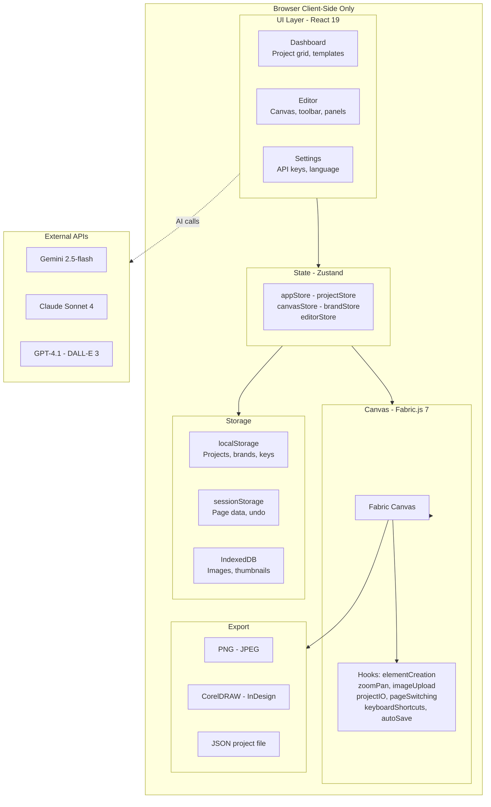

# Dessy

A professional leaflet design editor that runs entirely in the browser. Create flyers, brochures, menus, and marketing materials with a visual canvas editor, AI-powered generation, brand management, and multi-format export.

**Live demo:** [pokraev.github.io/dessy](https://pokraev.github.io/dessy/)

---

## Features

### Visual Canvas Editor
- Drag-and-drop element creation (text, shapes, images, color blocks)
- InDesign-style click-drag to draw frames with live preview
- Snap-to-edge alignment guides
- Undo/redo history (50 steps)
- Keyboard shortcuts (copy/paste, group/ungroup, nudge, select all)
- Multi-page support (bifold, trifold formats)
- Zoom/pan with scroll wheel and hand tool
- Right-click context menu
- Corner radius slider for rectangles

### Leaflet Formats
| Format | Size | Pages |
|--------|------|-------|
| A4 Single | 210 x 297 mm | 1 |
| A5 | 148 x 210 mm | 1 |
| DL | 99 x 210 mm | 1 |
| A4 Bifold | 420 x 297 mm | 2 |
| A4 Trifold | 630 x 297 mm | 3 |
| Custom | Any size | 1 |

### AI-Powered Generation
- **Leaflet generation** from text prompts, photos, or sketches
- **Image generation** with DALL-E 3 or Gemini for image frames
- **Prompt enrichment** with editorial, lifestyle, and bold variations
- **Brand extraction** from any website URL

### AI Providers (bring your own key)
| Provider | Leaflet Gen | Image Gen | Brand Extract |
|----------|-------------|-----------|---------------|
| Google Gemini (2.5-flash) | Yes | Yes | Yes |
| Anthropic Claude (Sonnet 4) | Yes | - | Yes |
| OpenAI (GPT-4.1 / DALL-E 3) | Yes | Yes | Yes |

Automatic fallback: if the primary provider fails (rate limit, error), Dessy tries the next configured provider.

### Brand Management
- Extract brand identity from any website (colors, typography, style)
- Save and manage multiple brands
- Apply brand to restyle any project (colors, fonts, typography presets)
- Swatch linking: change a brand color, all linked objects update across all pages

### Dashboard
- Project grid with live thumbnails
- Create from blank or 10 starter templates (8 categories)
- Duplicate, rename, delete projects
- Template gallery with category filtering and preview

### Export
| Format | Description |
|--------|-------------|
| PNG / JPEG | 72, 150, or 300 DPI |
| CorelDRAW | ExtendScript macro (.cdr) |
| InDesign | ExtendScript (.jsx) |
| JSON | Dessy project file (import/export) |

### Internationalization
- English and Bulgarian
- Language toggle in header and settings

---

## Architecture



### Key Design Decisions

- **No backend** -- runs 100% in the browser. API keys are stored in localStorage.
- **Fabric.js 7** for canvas rendering, serialization, and object manipulation.
- **`canvas.toObject(CUSTOM_PROPS)`** for all serialization (not `toJSON` or `toDatalessJSON`).
- **`loadCanvasJSON` wrapper** around Fabric's `loadFromJSON` to re-apply custom properties that Fabric drops during deserialization.
- **Zustand** for state management with subscriptions for canvas sync.
- **IndexedDB** for binary data (images, thumbnails) to avoid localStorage quota limits.

---

## Project Structure

```
src/
  components/
    dashboard/          # Dashboard, ProjectCard, ProjectGrid, EmptyState,
                        # NewLeafletModal, TemplateGallery
    editor/
      modals/           # GenerateLeafletModal, PromptCrafterModal,
                        # ExportModal, SettingsModal, GenerationPreview
      panels/           # LeftPanel, PropertiesPanel, ToolBar, LayersPanel,
                        # PagesPanel, SelectionActions, ContextMenu
        sections/       # FillSection, StrokeSection, TypographySection,
                        # PositionSection, StyleSection, etc.
      ui/               # Header, BottomBar, KeyboardShortcutsModal
    ui/                 # Toast, shared UI components
  hooks/                # useFabricCanvas, useElementCreation, useCanvasZoomPan,
                        # useImageUpload, useProjectIO, usePageSwitching,
                        # useKeyboardShortcuts, useAutoSave, useCanvasLayers,
                        # useHistory, useSelectedObject, useGoogleFonts
  lib/
    ai/                 # generate-leaflet, generate-image, canvas-loader,
                        # schema-validator, prompts/
    brand/              # extract-from-url, apply-brand, swatch-sync, preset-sync
    export/             # raster-export, coreldraw-export, indesign-export
    fabric/             # element-factory, canvas-config, load-canvas-json,
                        # serialization
    pages/              # page-crud
    storage/            # projectStorage, apiKeyStorage, brandStorage,
                        # thumbnailDb, imageDb
    templates/          # templates-index, template-utils
    thumbnails/         # capture
  stores/               # appStore, projectStore, canvasStore, brandStore,
                        # editorStore, promptCrafterStore
  templates/            # 10 starter template JSON files
  types/                # TypeScript type definitions
  i18n/                 # en.json, bg.json
  constants/            # formats
```

---

## Getting Started

### Prerequisites

- Node.js 20+
- npm 10+

### Install

```bash
git clone https://github.com/pokraev/dessy.git
cd dessy
npm install
```

### Development

```bash
npm run dev
```

Opens at [http://localhost:3002/dessy/](http://localhost:3002/dessy/)

### Build

```bash
npm run build
```

Output in `dist/`.

### Preview Production Build

```bash
npm run preview
```

Opens at [http://localhost:3002/dessy/](http://localhost:3002/dessy/)

### Run Tests

```bash
npx jest
```

106 tests across 14 suites.

---

## Configuration

### AI Providers

Dessy requires API keys to use AI features. Configure them in **Settings** (gear icon in the editor header).

| Provider | Get Key | Used For |
|----------|---------|----------|
| Google Gemini | [aistudio.google.com/apikey](https://aistudio.google.com/apikey) | Leaflet gen, image gen, brand extraction |
| Anthropic Claude | [console.anthropic.com](https://console.anthropic.com/settings/keys) | Leaflet gen, brand extraction |
| OpenAI | [platform.openai.com/api-keys](https://platform.openai.com/api-keys) | Leaflet gen, image gen (DALL-E 3), brand extraction |

Keys are stored in the browser's localStorage. No data is sent to any server other than the AI provider APIs.

### Language

Toggle between English and Bulgarian in the header or Settings modal.

---

## Deployment

Dessy deploys to GitHub Pages via GitHub Actions on push to `main`.

```yaml
# .github/workflows/deploy.yml
on:
  push:
    branches: [main]
```

The build uses `base: '/dessy/'` in `vite.config.ts` for the GitHub Pages subpath.

To deploy to a custom domain, update `base` in `vite.config.ts` and the `server.port` if needed.

---

## Tech Stack

| Layer | Technology |
|-------|-----------|
| Framework | React 19 |
| Build | Vite 8 |
| Canvas | Fabric.js 7 |
| State | Zustand 5 |
| Styling | Tailwind CSS 4 |
| Animation | Motion (Framer Motion) |
| Icons | Lucide React |
| i18n | react-i18next |
| Storage | localStorage + IndexedDB (idb) |
| Export | file-saver, JSZip |
| Tests | Jest + ts-jest |
| Deploy | GitHub Pages + GitHub Actions |

---

## Keyboard Shortcuts

| Shortcut | Action |
|----------|--------|
| V | Select tool |
| T | Text tool |
| R | Rectangle tool |
| C | Circle tool |
| L | Line tool |
| I | Image tool |
| H | Hand (pan) tool |
| Ctrl+Z | Undo |
| Ctrl+Shift+Z | Redo |
| Ctrl+C | Copy |
| Ctrl+V | Paste |
| Ctrl+A | Select all |
| Ctrl+S | Save |
| Ctrl+G | Group |
| Ctrl+Shift+G | Ungroup |
| Delete / Backspace | Delete selected |
| Arrow keys | Nudge 1px |
| Shift+Arrow | Nudge 10px |
| Escape | Dismiss busy modal |

---

## License

Private project.
